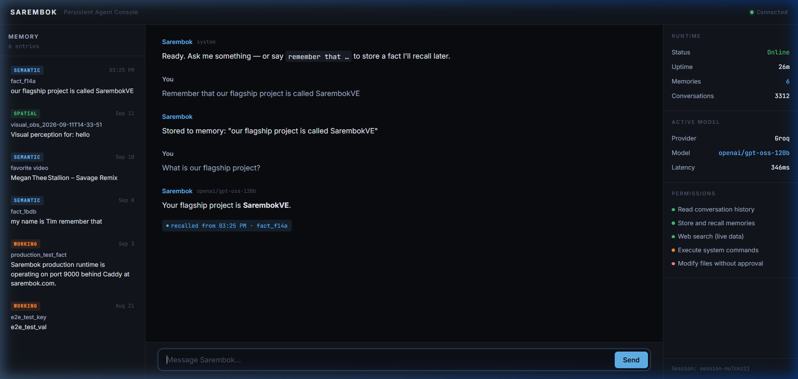

# SarembokVE

An AI runtime with persistent memory, multi-agent orchestration, and provider-independent model routing.

**[Try the Console →](https://sarembok.com/console)**

---

## What It Does Today

SarembokVE is a cloud-hosted AI agent platform. You connect via WebSocket, send a message, and the agent responds — but unlike a stateless chatbot, it **remembers**.

Say `"remember that my project deadline is March 15"` and it stores that fact in SQLite-WAL persistent memory. Ask about your project next week, next month, or next session — the agent recalls it, tags the recall in the response, and you can see exactly which memories were used.

### Persistent Agent Console



The console is a three-panel interface that makes the system's state visible:

| Panel | What It Shows |
|-------|--------------|
| **Left: Memory Timeline** | Every fact the agent has stored, timestamped, categorized by tier (SEMANTIC, WORKING, SPATIAL), inspectable |
| **Center: Conversation** | Chat with recall annotations — when the agent uses a memory, it shows which memory and when it was stored |
| **Right: System State** | Live runtime status, uptime, memory count, active model/provider, latency, permissions |

Nothing is hidden behind marketing language. If the system does something, you can see it.

## Architecture

```
Browser ──WebSocket──→ Cloud Runtime (Python/asyncio)
                           │
                           ├─ JSON-RPC Protocol (40+ methods)
                           ├─ SQLite-WAL Persistence (memories, conversations, events, agents)
                           ├─ Provider Router (OpenAI, Gemini, Groq, OpenRouter, custom endpoints)
                           ├─ Multi-Agent Fabric (Strategist → Worker → Auditor loop)
                           ├─ Memory Recall (keyword search → context injection → recall annotations)
                           └─ Worker Registry (distributed compute coordination)
```

### What's Real

| Component | Implementation | Status |
|-----------|---------------|--------|
| WebSocket transport | `websockets` library, async connection handling | ✅ Production |
| JSON-RPC protocol | 40+ methods: `SarembokChat`, `StoreMemory`, `ListMemories`, `SearchMemories`, `GetRuntimeInfo`, etc. | ✅ Production |
| Persistent memory | SQLite-WAL with tiered storage (SEMANTIC, WORKING, SPATIAL, CORE), keyword recall into LLM context | ✅ Production |
| Provider routing | `ProviderRouter` class supporting OpenAI, Gemini, Groq, OpenRouter with automatic fallback | ✅ Production |
| Session auth | Browser session tokens with TTL, HMAC validation | ✅ Production |
| Conversation history | Per-session storage with deduplication and retrieval | ✅ Production |
| Agent creation | Dynamic agent spawning via chat ("create an agent named X") | ✅ Production |
| Multi-agent fabric | Strategist → Worker → Auditor loop with Shannon entropy loop detection | ✅ Built |
| Worker registry | Worker registration, heartbeat, task claiming, stale pruning | ✅ Built |
| Event sourcing | `knowledge_events` + `knowledge_snapshots` tables in WAL mode | ✅ Built |
| Digital human sessions | Session management API (create/get/list/close) | 🔨 Scaffolded |
| OS/Kernel layer | Architecture direction, not implemented | 📋 Planned |

### What's Not Real Yet

- **The "OS" and "kernel"** — The system runs as a Python process on Linux containers, not as a standalone operating system. The `fabric/` directory implements a multi-agent flywheel, not a kernel.
- **Digital-human embodiment** — Session management exists but no Unreal Engine/MetaHuman rendering pipeline is connected.
- **Distributed GPU compute** — Worker registration and task assignment are built, but no GPU cluster is deployed.

## Quick Start

```bash
# Clone
git clone https://github.com/jetsontech/SarembokVE.git
cd SarembokVE

# Set at least one provider key
export GEMINI_API_KEY="your-key"
# or: OPENAI_API_KEY, GROQ_API_KEY, OPENROUTER_API_KEY

# Run with Docker
cd Deployment/cloud
docker compose up

# Open the console
# http://localhost:9000 → serves frontend/console.html
```

### Without Docker

```bash
cd Deployment/cloud
pip install websockets
python server.py
# Connects on ws://localhost:9000
```

## Project Structure

```
SarembokVE/
├── Deployment/cloud/
│   ├── server.py              # Main runtime (4500 lines, WebSocket + JSON-RPC)
│   ├── provider_router.py     # Multi-provider LLM routing with fallback
│   ├── runtime_authority.py   # System state snapshots
│   ├── capability_registry.py # Runtime capability declarations
│   └── compose.yaml           # Docker deployment
├── Runtime/
│   ├── memory.py                        # Key-value memory store
│   ├── sarembok_knowledge_sqlite.py     # Event-sourced knowledge persistence
│   └── sarembok_voice_orchestrator.py   # Voice + agent state machine
├── fabric/
│   └── src/agents/                      # Multi-agent orchestration (JS)
├── frontend/
│   ├── console.html           # Persistent Agent Console (3-panel UI)
│   └── index.html             # Landing page
└── backend/
    └── main.py                # FastAPI proxy for Gemini Live
```

## API Reference (JSON-RPC over WebSocket)

```json
// Send a message
{"jsonrpc": "2.0", "id": "1", "method": "SarembokChat", "params": {"prompt": "hello", "sessionId": "my-session"}}

// Store a memory
{"jsonrpc": "2.0", "id": "2", "method": "StoreMemory", "params": {"key": "deadline", "value": "March 15", "tier": "SEMANTIC"}}

// List all memories
{"jsonrpc": "2.0", "id": "3", "method": "ListMemories", "params": {}}

// Search memories
{"jsonrpc": "2.0", "id": "4", "method": "SearchMemories", "params": {"query": "deadline"}}

// Get runtime status
{"jsonrpc": "2.0", "id": "5", "method": "GetRuntimeInfo", "params": {}}
```

## Direction

SarembokVE aims to become a full AI-native computing environment — persistent agents with real identity, an OS-level execution layer, digital-human embodiment, and distributed compute. The items in the "What's Not Real Yet" section above are the roadmap.

The principle is simple: **build the thing, then describe it.** Not the other way around.

## License

Proprietary. See repository for terms.

---

**SarembokVE** · [sarembok.com](https://sarembok.com) · [GitHub](https://github.com/jetsontech/SarembokVE)
