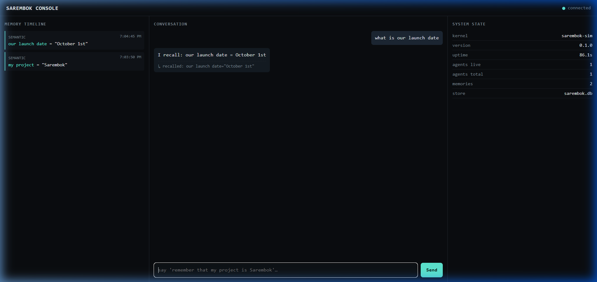

# Sarembok OS

An AI agent operating system where agent **identity, memory, and state** are kernel-level primitives — persistent across process restart, backed by SQLite-WAL, and inspectable in real time.



## What Works Today

1. **Persistent Memory Simulation (`sim/`)**:
   - Agent-process table with real lifecycle (`spawn_agent`, `kill_agent`, `restore_agent`).
   - SQLite-WAL persistent memory arena (`remember`, `recall`).
   - Tiered kernel eviction (`CORE` never evicted; `WORKING` evicted first; `SEMANTIC` by LRU+retention).
   - Fault isolation: faulted agents do not crash the kernel or corrupt survivor memory.
2. **Interactive Console (`console/`)**:
   - Real-time 3-panel UI: **Memory Timeline**, **Conversation** (with recall annotations), and **System State**.
   - Backed by JSON-RPC over WebSocket (`sim/console_bridge.py`).
3. **Verified Claims & CI**:
   - Every public claim is backed by an automated acceptance test in `tests/acceptance/`.
   - CI rejects any unproven claim (`tools/claim-verify/verify.sh`).

## Quick Start

### 1. Run Acceptance Suite
```bash
python sim/run_tests.py
# or via bash runner:
bash tests/run_acceptance.sh
```

### 2. Launch Local Console
```bash
python sim/console_bridge.py --http-port 8080 --ws-port 9001
```
Open **`http://localhost:8080`** in your browser.

### 3. Verify Claims CI
```bash
bash tools/claim-verify/verify.sh
```

## Architecture

```
USERSIDE: Console UI (HTTP :8080 / WS :9001)
---------------------------------------------------------------
SYSTEM LAYER: JSON-RPC Bridge (sim/console_bridge.py)
---------------------------------------------------------------
SAREMBOK KERNEL SERVICES (sim/kernel.py + sim/store_sqlite.py)
  Agent-Process Table | Memory Arena Manager | SQLite-WAL Store
---------------------------------------------------------------
PORT TARGET: seL4 Microkernel (kernel/ — C skeleton, M0-M2)
```

## Roadmap

- **M0 Boot**: seL4 microkernel foundation and bootable QEMU image.
- **M1 Kernel Core**: seL4 native agent-process table and hardware memory protection.
- **M2 Persistent Memory**: Direct kernel-level persistent memory arena on disk.
- **M3 Intent Scheduler**: Schedulable across CPU, remote workers, and inference calls.
- **M4 Distributed Task Migration**: Seamless migration between physical nodes.
- **M5 Embodiment**: Persistent embodied avatar identity rendered via WebGPU/Unreal.

## License
Proprietary.
